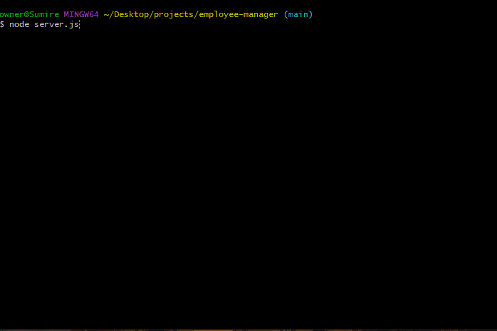

# Employee Manager
An application where you can see employee info (salary, role, id, reporting manager, etc.) depending on your choice
on the menu. You may also add a new employee, role, and department.

## Built With 
* MySQL
* Nodejs
* JavaScript

## Installation

    ### npm packages used: 

    * inquirer
    * console.table
    * MySQL 2
    * dotenv

    run schema.sql
    (optional) run seeds.sql

## Hardships

There is a function still unfinished and quite a few more could be added to improve the application. 
I first attempted to put functions into different files but ran into depency issues. Due to time
conflicts, I abandoned that course of action and put everything into one file. I attempted to use
mysql promises but I couldn't figure out how to get it to work properly. I abandoned this as well and 
decided to go with brute forcing whatever would work. 

## Visual
